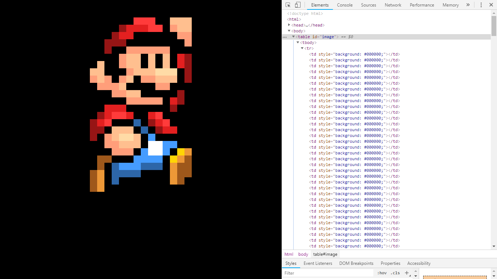
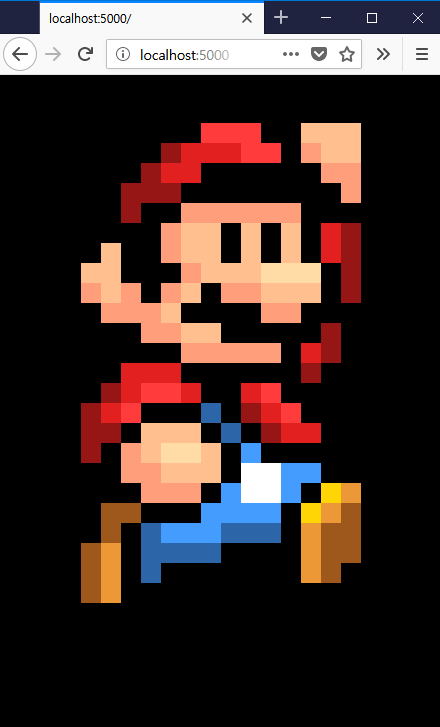
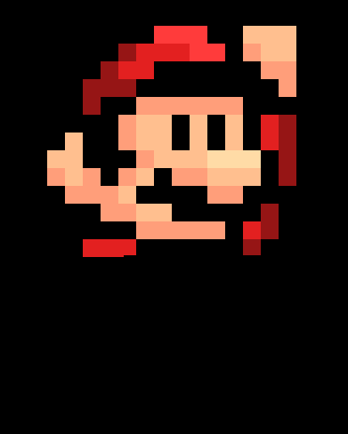
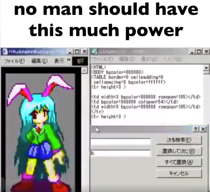
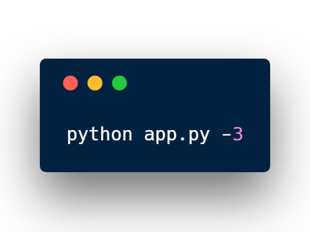

# Table Frontend

I got the Mario image from [here](http://pixelartmaker.com/art/7dd56f5049ccd8c).

It is also responsive a little bit :)

No animation is needed if you use this on your website.

It is so slow, that It looks like the image is appearing from the top!

Python was powerful enough.

## Usage

You might need to install the module Pillow.

Please note that this project is written in Python 3.

Use the command above to start the Flask web server.

Change the `mario.png` in the current folder to another image of your own.

Open your favorite web browser, go to `http://localhost:5000`, and get your cool frontend code!
